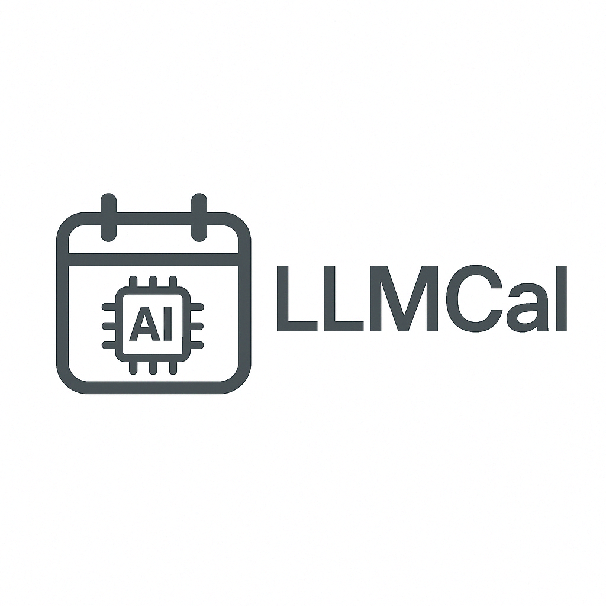

# LLMCal — PopClip AI Calendar Extension

<div align="center">

**[English](#english)** | **[中文](#chinese)** | **[Español](#español)** | **[Français](#français)** | **[Deutsch](#deutsch)** | **[日本語](#japanese)**

</div>

# English

<div align="center">
  

  <h1>LLMCal - AI-Powered Calendar Event Creator for PopClip</h1>

  <!-- Project badges -->
  <a href="https://cafferychen777.github.io/LLMCal/" target="_blank">
    
  </a>
  <a href="https://github.com/cafferychen777/LLMCal/actions/workflows/test.yml">
    
  </a>
  <a href="https://github.com/cafferychen777/LLMCal/actions/workflows/e2e.yml">
    
  </a>
  <a href="https://github.com/cafferychen777/LLMCal/actions/workflows/deploy.yml">
    
  </a>
  <a href="https://github.com/cafferychen777/LLMCal/stargazers">
    
  </a>
  <a href="https://github.com/cafferychen777/LLMCal/network/members">
    
  </a>
  <a href="https://github.com/cafferychen777/LLMCal/issues">
    
  </a>
  <a href="https://github.com/cafferychen777/LLMCal/discussions">
    
  </a>
  <a href="https://github.com/cafferychen777/LLMCal/releases">
    
  </a>
  <a href="https://github.com/cafferychen777/LLMCal/blob/main/LICENSE">
    
  </a>
  <a href="https://shields.io/category/platforms">
    
  </a>
  <a>
    
  </a>
  <a>
    
  </a>
<p align="center">
  <a href="https://cafferychen777.github.io/LLMCal/features.html">
    
  </a>
</p>

  <a href="https://github.com/cafferychen777/LLMCal/pulls">
    
  </a>
  <a href="https://www.popclip.app/">
    
  </a>
</div>

> Quick Install: Download latest release → Double‑click → Enter API key → Select text → Click calendar icon

<div align="center">
  <a href="https://github.com/cafferychen777/LLMCal/releases" style="margin-right:10px;">⬇️ Download</a>
  ·
  <a href="https://cafferychen777.github.io/LLMCal/get-started.html" style="margin:0 10px;">🚀 Get Started</a>
  ·
  <a href="https://cafferychen777.github.io/LLMCal/features.html" style="margin-left:10px;">✨ Features</a>
</div>


> Turn highlighted text into calendar events in seconds — multilingual, recurring, reminders, attendees, and meeting links.

LLMCal is a PopClip extension for macOS that uses AI to convert natural language into calendar events for Apple Calendar (and Google Calendar via macOS integration). It extracts titles, times, locations, attendees, meeting links (Zoom/Teams/Meet), recurring rules, and reminders.
## Table of Contents
- [Features](#features)
- [Installation](#installation)
- [Usage](#usage)
- [Example Inputs](#example-inputs)
- [Google Calendar Integration](#google-calendar-integration)
- [Privacy & Security](#privacy--security)
- [Why LLMCal? (Use Cases & Alternatives)](#why-llmcal-use-cases--alternatives)
- [Quick Start Guide](#quick-start-guide)
- [Advanced Configuration](#advanced-configuration)
- [Troubleshooting](#troubleshooting)
- [FAQ](#faq)
- [Comparison to Alternatives](#comparison-to-alternatives)
- [Community & Support](#community--support)


## Features

- 🤖 **AI-Powered**: Uses Claude AI to understand natural language event descriptions
- ⚡️ **Quick Creation**: Create calendar events with a single click
- 🌐 **Meeting Links**: Automatically extracts and adds meeting URLs (Zoom, Teams, Google Meet, etc.)
- 📍 **Location Support**: Handles both physical and virtual meeting locations
- ⏰ **Smart Reminders**: Sets up event alerts based on text descriptions
- 🔄 **Recurring Events**: Supports various recurring event patterns
- 👥 **Attendees**: Automatically adds event participants from email addresses in the text
- 🌍 **Time Zones**: Understands and handles different time zones in event descriptions

> See full feature highlights: https://cafferychen777.github.io/LLMCal/features.html


## Prerequisites

1. **PopClip Installation**
   - Download PopClip from [https://www.popclip.app/](https://www.popclip.app/)
   - PopClip requires macOS 10.13 or later
   - After installation, allow PopClip in System Settings:
     - Go to System Settings > Privacy & Security > Accessibility
     - Enable PopClip in the list of allowed apps

2. **Anthropic API Key**
   - Sign up for an account at [Anthropic](https://console.anthropic.com/)
   - Create an API key from your dashboard
   - Keep this key handy for the LLMCal setup

## Installation

1. **Install LLMCal Extension**
   - Download the latest release (`LLMCal.popclipext.zip`) from the [Releases page](https://github.com/cafferychen777/LLMCal/releases)
   - Double-click the downloaded file to install it in PopClip
   - When prompted, click "Install Extension"

2. **Configure LLMCal**
   - Open PopClip's preferences (click the PopClip icon in the menu bar and select the gear icon)
   - Find and click on the LLMCal extension in the extensions list
   - Enter your Anthropic API key in the settings field
   - Click "Save" to apply the changes

3. **Verify Installation**
   - The calendar icon should appear in the PopClip menu when you select text
   - If you don't see PopClip when selecting text:
     - Make sure PopClip is running (the icon should be visible in the menu bar)
     - Try selecting text again in any application
     - If needed, restart PopClip from the menu bar icon

## Usage

1. Select any text that describes an event, for example:
   - "Team meeting tomorrow at 2pm for 1 hour"
   - "Weekly standup every Monday at 9:30am, 30 minutes, Zoom link: https://zoom.us/j/123"
   - "Lunch with John next Friday at noon at Starbucks downtown"
2. Click the calendar icon in the PopClip menu
3. The event will be automatically created in your calendar with all relevant details

## Example Inputs

```
"Product demo next Tuesday 3pm with client@example.com, 1 hour on Zoom https://zoom.us/j/123, remind me 15 minutes before"

"Monthly team review on the last Friday of each month, 2pm-4pm, Conference Room A, reminder 1 day before"

"Weekly 1:1 with manager every Thursday 10am PST (my time 1pm EST), 30 minutes, Teams link: https://teams.microsoft.com/l/123"
```

## Technical Requirements

| Component | Minimum Requirement | Recommended |
|-----------|---------------------|-------------|
| **macOS** | 10.15 Catalina | 11.0 Big Sur or later |
| **PopClip** | 2022.5 | Latest version |
| **Memory** | 256 MB RAM | 512 MB RAM |
| **Network** | Active internet connection | Stable broadband |
| **Calendar** | Calendar.app access | Google Calendar sync |

### System Dependencies
- **Anthropic API Key** - Required for AI processing
- **Calendar Permissions** - System-level calendar access
- **Network Access** - For API communication and meeting link validation

## Google Calendar Integration

While LLMCal currently works directly with Apple Calendar, you can still use it with Google Calendar by following these steps:

1. **Add Google Calendar to Apple Calendar**
   - Open System Settings on your Mac
   - Go to "Internet Accounts"
   - Click "Add Account" and select "Google"
   - Sign in with your Google account
   - Make sure "Calendar" is checked in the list of services
   - Your Google Calendar will now sync with Apple Calendar

2. **Usage Tips**
   - Events created through LLMCal will automatically sync to your Google Calendar
   - All events, reminders, and updates will be synchronized between both calendars
   - You can manage which calendars to show/hide in Apple Calendar's sidebar
   - The sync is bi-directional: changes made in Google Calendar will appear in Apple Calendar and vice versa

3. **Troubleshooting**
   - If events aren't syncing, check your internet connection
   - Ensure your Google account is properly connected in System Settings
## FAQ

- Does it work with Google Calendar?
  - Yes. Connect Google account to Apple Calendar on macOS; events created via LLMCal sync to Google Calendar.
- Does it detect recurring events and reminders?
  - Yes. It parses common recurring patterns and reminders from natural language.
- Does it support Zoom/Teams/Meet links?
  - Yes. Meeting URLs in the selected text are extracted and added to the event.

## Comparison to Alternatives

- PopClip + LLMCal vs full calendar apps: much faster for “highlight text → create event”, zero window/context switching
- Native calendar parsing: typically limited; LLMCal leverages AI (Claude) for more robust extraction (attendees, locations, time zones)
- Browser extensions: require browser context; LLMCal works system-wide on macOS via PopClip

## Community & Support

- Issues: use the templates to report bugs and request features
- Discussions: share ideas and Q&A in GitHub Discussions
- Security: report privately via Security Advisory
- Docs: see docs/INSTALLATION.md, docs/DEVELOPMENT.md, docs/TROUBLESHOOTING.md, and CONTRIBUTING.md

   - Try removing and re-adding your Google account if issues persist
   - Check if you've granted necessary permissions to both calendars

## Privacy & Security

- Your API key is stored securely in PopClip's settings
- No event data is stored or transmitted except to create the calendar event
- All natural language processing is done through Claude AI
- The extension only requires necessary permissions: text selection and calendar access

## Why LLMCal? (Use Cases & Alternatives)

- Rapidly create Apple/Google Calendar events on macOS from highlighted text
- Reliable parsing of reminders, recurring rules (RRULE), locations, and meeting links (Zoom/Teams/Meet)
- Lightweight PopClip workflow vs. full-blown calendar apps or browser extensions

## Quick Start Guide

### ⚡ 5-Minute Setup
1. **Download & Install PopClip** → [www.popclip.app](https://www.popclip.app/)
2. **Get API Key** → [console.anthropic.com](https://console.anthropic.com/)
3. **Install LLMCal** → Download from [releases](https://github.com/cafferychen777/LLMCal/releases)
4. **Configure** → Enter API key in PopClip preferences
5. **Test** → Select text and click calendar icon

### 🎯 First Event
Try selecting this text: *"Team standup tomorrow at 9am for 30 minutes"*

## Advanced Configuration

### Environment Variables (Optional)
```bash
# Create ~/.llmcal/config
ANTHROPIC_API_KEY=your_key_here
DEFAULT_TIMEZONE=America/New_York
LOG_LEVEL=info
```

### Language Settings
LLMCal automatically detects your system language and supports:
- 🇺🇸 English
- 🇨🇳 中文 (Chinese)
- 🇪🇸 Español (Spanish)
- 🇫🇷 Français (French)
- 🇩🇪 Deutsch (German)
- 🇯🇵 日本語 (Japanese)

## Troubleshooting

### Common Issues

#### 🔑 API Key Problems
**Issue**: "Invalid API key" error
**Solution**:
1. Verify your API key at [console.anthropic.com](https://console.anthropic.com/)
2. Check for extra spaces or characters
3. Restart PopClip after updating

#### 📅 Calendar Access
**Issue**: Events not appearing in calendar
**Solution**:
1. System Settings → Privacy & Security → Full Disk Access → Enable PopClip
2. Restart Calendar.app
3. Check if Calendar.app has proper permissions

#### 🌐 Network Issues
**Issue**: "API request failed" error
**Solution**:
1. Verify internet connection
2. Check firewall settings
3. Try a different network if available

#### 📱 PopClip Not Appearing
**Issue**: PopClip menu doesn't show when selecting text
**Solution**:
1. Ensure PopClip is running (menu bar icon visible)
2. System Settings → Accessibility → Enable PopClip
3. Try selecting text again or restart PopClip

### Getting Help
- **Documentation**: Visit [docs/TROUBLESHOOTING.md](docs/TROUBLESHOOTING.md)
- **Issues**: Report bugs on [GitHub Issues](https://github.com/cafferychen777/LLMCal/issues)
- **Discussions**: Join [GitHub Discussions](https://github.com/cafferychen777/LLMCal/discussions)

## Support

For issues, feature requests, or contributions, please visit the [GitHub repository](https://github.com/cafferychen777/LLMCal).

## License

This project is licensed under the GNU Affero General Public License Version 3 (AGPLv3) with Commons Clause - see the [LICENSE](LICENSE) file for details. This license ensures that the software remains open source while protecting against commercial exploitation. Any modifications or derivative works must also be released under the same license terms.

# 中文

<div align="center">
  

  <h1>LLMCal - 基于 AI 的 PopClip 日历事件创建工具</h1>

  <a href="https://cafferychen777.github.io/LLMCal/" target="_blank">
    
  </a>
  <a href="https://github.com/cafferychen777/LLMCal/stargazers">
    
  </a>
  <a href="https://github.com/cafferychen777/LLMCal/network/members">
    
  </a>
  <a href="https://github.com/cafferychen777/LLMCal/issues">
    
  </a>
  <a href="https://github.com/cafferychen777/LLMCal/blob/main/LICENSE">
    
  </a>
  <a href="https://github.com/cafferychen777/LLMCal/releases">
    
  </a>
  <a href="https://www.popclip.app/">
    
  </a>
</div>

LLMCal 是一个强大的 PopClip 扩展，使用 AI 将选定的文本转换为日历事件。它能理解自然语言描述，并自动创建包含适当标题、时间、地点、会议链接和提醒的事件。

## 特点

- 🤖 **AI 驱动**：使用 Claude AI 理解自然语言事件描述
- ⚡️ **快速创建**：一键创建日历事件
- 🌐 **会议链接**：自动提取并添加会议 URL（Zoom、Teams、Google Meet 等）
- 📍 **位置支持**：处理实体和虚拟会议地点
- ⏰ **智能提醒**：根据文本描述设置事件提醒
- 🔄 **重复事件**：支持各种重复事件模式
- 👥 **参与者**：自动从文本中的电子邮件地址添加事件参与者
- 🌍 **时区**：理解并处理事件描述中的不同时区

## 前提条件

1. **PopClip 安装**
   - 从 [https://www.popclip.app/](https://www.popclip.app/) 下载 PopClip
   - PopClip 需要 macOS 10.13 或更高版本
   - 安装后，在系统设置中允许 PopClip：
     - 转到系统设置 > 隐私与安全 > 辅助功能
     - 在允许的应用程序列表中启用 PopClip

2. **Anthropic API 密钥**
   - 在 [Anthropic](https://console.anthropic.com/) 注册一个账户
   - 从您的仪表板创建一个 API 密钥
   - 为 LLMCal 设置保留此密钥

## 安装

1. **安装 LLMCal 扩展**
   - 从 [发布页面](https://github.com/cafferychen777/LLMCal/releases) 下载最新版本（`LLMCal.popclipext.zip`）
   - 双击下载的文件以在 PopClip 中安装
   - 出现提示时，点击“安装扩展”

2. **配置 LLMCal**
   - 打开 PopClip 的偏好设置（点击菜单栏中的 PopClip 图标并选择齿轮图标）
   - 在扩展列表中找到并点击 LLMCal 扩展
   - 在设置字段中输入您的 Anthropic API 密钥
   - 点击“保存”以应用更改

3. **验证安装**
   - 选择文本时，PopClip 菜单中应该出现日历图标
   - 如果您没有看到 PopClip：
     - 确保 PopClip 正在运行（菜单栏中应该可见图标）
     - 尝试在任何应用程序中再次选择文本
     - 如果需要，从菜单栏图标重新启动 PopClip

## 使用方法

1. 选择任何描述事件的文本，例如：
   - "明天下午2点开一小时的团队会议"
   - "每周一上午9:30的站会，30分钟，Zoom链接：https://zoom.us/j/123"
   - "下周五中午和约翰在市中心星巴克吃午饭"
2. 点击 PopClip 菜单中的日历图标
3. 事件将自动创建在您的日历中，包含所有相关详细信息

## 输入示例

```
"下周二下午3点与 client@example.com 进行产品演示，1小时，Zoom会议 https://zoom.us/j/123，提前15分钟提醒"

"每月最后一个周五下午2点到4点的月度团队回顾，会议室A，提前1天提醒"

"每周四上午10点PST（我的时间是EST下午1点）与经理进行30分钟的一对一会议，Teams链接：https://teams.microsoft.com/l/123"
```

## 系统要求

- macOS 10.15 或更高版本
- PopClip 2022.5 或更高版本
- Anthropic API 密钥
- Calendar.app 访问权限
- 互联网连接

## Google 日历集成

虽然 LLMCal 目前直接与 Apple 日历一起工作，但您仍然可以按照以下步骤使用它与 Google 日历：

1. **将 Google 日历添加到 Apple 日历**
   - 在您的 Mac 上打开系统设置
   - 转到“互联网账户”
   - 点击“添加账户”并选择“Google”
   - 使用您的 Google 账户登录
   - 确保服务列表中选中了“日历”
   - 您的 Google 日历现在将与 Apple 日历同步

2. **使用提示**
   - 通过 LLMCal 创建的事件将自动同步到您的 Google 日历
   - 所有事件、提醒和更新都将在两个日历之间同步
   - 您可以在 Apple 日历的侧边栏中管理显示/隐藏哪些日历
   - 同步是双向的：在 Google 日历中进行的更改将出现在 Apple 日历中，反之亦然

3. **故障排除**
   - 如果事件没有同步，请检查您的互联网连接
   - 确保您的 Google 账户在系统设置中正确连接
   - 如果问题持续，请尝试删除并重新添加您的 Google 账户
   - 检查是否已授予两个日历必要的权限

## 隐私与安全

- 你的 API 密钥安全存储在 PopClip 的设置中
- 除了创建日历事件外，不存储或传输任何事件数据
- 所有自然语言处理通过 Claude AI 完成
- 扩展仅需要必要的权限：文本选择和日历访问

## 故障排除

如果遇到任何问题：
1. 确保在扩展设置中正确输入了 Anthropic API 密钥
2. 检查是否已授予 PopClip 日历访问权限
3. 确保你的文本选择包含所有必要的事件详细信息
4. 验证你的互联网连接

## 支持

如有问题、功能请求或贡献，请访问 [GitHub 仓库](https://github.com/cafferychen777/LLMCal)。

## 许可证

本项目采用带有 Commons Clause 的 GNU Affero 通用公共许可证第3版 (AGPLv3) 授权 - 详见 [LICENSE](LICENSE) 文件。该许可证确保软件保持开源的同时防止商业利用。任何修改或衍生作品也必须在相同的许可条款下发布。

---

# Español

<div align="center">
  

  <h1>LLMCal - Creador de Eventos de Calendario Impulsado por IA para PopClip</h1>

  <a href="https://cafferychen777.github.io/LLMCal/" target="_blank">
    
  </a>
  <a href="https://github.com/cafferychen777/LLMCal/stargazers">
    
  </a>
  <a href="https://github.com/cafferychen777/LLMCal/network/members">
    
  </a>
  <a href="https://github.com/cafferychen777/LLMCal/issues">
    
  </a>
  <a href="https://github.com/cafferychen777/LLMCal/blob/main/LICENSE">
    
  </a>
  <a href="https://github.com/cafferychen777/LLMCal/releases">
    
  </a>
  <a href="https://www.popclip.app/">
    
  </a>
</div>

LLMCal es una potente extensión de PopClip que utiliza IA para convertir texto seleccionado en eventos de calendario. Comprende descripciones en lenguaje natural y crea automáticamente eventos con títulos, horarios, ubicaciones, enlaces de reunión y recordatorios apropiados.

## Características

- 🤖 **Impulsado por IA**: Utiliza Claude AI para comprender descripciones de eventos en lenguaje natural
- ⚡️ **Creación Rápida**: Crea eventos de calendario con un solo clic
- 🌐 **Enlaces de Reunión**: Extrae y añade automáticamente URLs de reuniones (Zoom, Teams, Google Meet, etc.)
- 📍 **Soporte de Ubicación**: Maneja ubicaciones de reuniones tanto físicas como virtuales
- ⏰ **Recordatorios Inteligentes**: Configura alertas de eventos basadas en descripciones de texto
- 🔄 **Eventos Recurrentes**: Soporta varios patrones de eventos recurrentes
- 👥 **Participantes**: Añade automáticamente participantes del evento desde direcciones de correo electrónico en el texto
- 🌍 **Zonas Horarias**: Comprende y maneja diferentes zonas horarias en las descripciones de eventos

## Prerrequisitos

1. **Instalación de PopClip**
   - Descarga PopClip desde [https://www.popclip.app/](https://www.popclip.app/)
   - PopClip requiere macOS 10.13 o posterior
   - Después de la instalación, permite PopClip en la configuración del sistema:
     - Ve a Configuración del sistema > Privacidad y seguridad > Accesibilidad
     - Activa PopClip en la lista de aplicaciones permitidas

2. **Clave API de Anthropic**
   - Registra una cuenta en [Anthropic](https://console.anthropic.com/)
   - Crea una clave API desde tu panel de control
   - Conserva esta clave para la configuración de LLMCal

## Instalación

1. **Instalar la extensión LLMCal**
   - Descarga la última versión (`LLMCal.popclipext.zip`) desde la [página de lanzamientos](https://github.com/cafferychen777/LLMCal/releases)
   - Haz doble clic en el archivo descargado para instalarlo en PopClip
   - Cuando se te solicite, haz clic en "Instalar Extensión"

2. **Configurar LLMCal**
   - Abre las preferencias de PopClip (haz clic en el icono de PopClip en la barra de menús y selecciona el icono de engranaje)
   - Encuentra y haz clic en la extensión LLMCal en la lista de extensiones
   - Ingresa tu clave API de Anthropic en el campo de configuración
   - Haz clic en "Guardar" para aplicar los cambios

3. **Verificar la instalación**
   - El icono del calendario debería aparecer en el menú de PopClip cuando seleccionas texto
   - Si no ves PopClip cuando seleccionas texto:
     - Asegúrate de que PopClip esté en ejecución (el icono debería ser visible en la barra de menús)
     - Intenta seleccionar texto de nuevo en cualquier aplicación
     - Si es necesario, reinicia PopClip desde el icono de la barra de menús

## Uso

1. Selecciona cualquier texto que describa un evento, por ejemplo:
   - "Reunión de equipo mañana a las 2pm por 1 hora"
   - "Reunión semanal todos los lunes a las 9:30am, 30 minutos, enlace de Zoom: https://zoom.us/j/123"
   - "Almuerzo con Juan el próximo viernes al mediodía en el Starbucks del centro"
2. Haz clic en el icono del calendario en el menú de PopClip
3. El evento se creará automáticamente en tu calendario con todos los detalles relevantes

## Ejemplos de Entrada

```
"Demostración de producto el próximo martes a las 3pm con client@example.com, 1 hora en Zoom https://zoom.us/j/123, recordarme 15 minutos antes"

"Revisión mensual del equipo el último viernes de cada mes, 2pm-4pm, Sala de Conferencias A, recordatorio 1 día antes"

"Reunión semanal 1:1 con el gerente todos los jueves 10am PST (mi hora 1pm EST), 30 minutos, enlace de Teams: https://teams.microsoft.com/l/123"
```

## Requisitos

- macOS 10.15 o posterior
- PopClip 2022.5 o posterior
- Clave API de Anthropic
- Permiso de acceso a Calendar.app
- Conexión a Internet

## Integración con Google Calendar

Aunque LLMCal actualmente funciona directamente con Apple Calendar, puedes seguir utilizando Google Calendar siguiendo estos pasos:

1. **Agregar Google Calendar a Apple Calendar**
   - Abre la configuración del sistema en tu Mac
   - Ve a "Cuentas de Internet"
   - Haz clic en "Agregar cuenta" y selecciona "Google"
   - Inicia sesión con tu cuenta de Google
   - Asegúrate de que "Calendario" esté seleccionado en la lista de servicios
   - Tu calendario de Google ahora se sincronizará con Apple Calendar

2. **Consejos de uso**
   - Los eventos creados a través de LLMCal se sincronizarán automáticamente con tu calendario de Google
   - Todos los eventos, recordatorios y actualizaciones se sincronizarán entre ambos calendarios
   - Puedes gestionar qué calendarios mostrar/ocultar en la barra lateral de Apple Calendar
   - La sincronización es bidireccional: los cambios realizados en Google Calendar aparecerán en Apple Calendar y viceversa

3. **Solución de problemas**
   - Si los eventos no se sincronizan, verifica tu conexión a Internet
   - Asegúrate de que tu cuenta de Google esté correctamente conectada en la configuración del sistema
   - Intenta eliminar y volver a agregar tu cuenta de Google si persisten los problemas
   - Verifica si has otorgado los permisos necesarios a ambos calendarios

## Privacidad y Seguridad

- Tu clave API se almacena de forma segura en la configuración de PopClip
- No se almacena ni transmite ningún dato de eventos excepto para crear el evento del calendario
- Todo el procesamiento del lenguaje natural se realiza a través de Claude AI
- La extensión solo requiere los permisos necesarios: selección de texto y acceso al calendario

## Solución de Problemas

Si encuentras algún problema:
1. Asegúrate de que tu clave API de Anthropic esté correctamente ingresada en la configuración de la extensión
2. Verifica que hayas otorgado permisos de acceso al calendario a PopClip
3. Asegúrate de que tu selección de texto incluya todos los detalles necesarios del evento
4. Verifica tu conexión a Internet

## Soporte

Para problemas, solicitudes de funciones o contribuciones, visita el [Repositorio de GitHub](https://github.com/cafferychen777/LLMCal).

## Licencia

Este proyecto está licenciado bajo la Licencia Pública General de GNU Affero Versión 3 (AGPLv3) con Cláusula Commons - consulta el archivo [LICENSE](LICENSE) para más detalles. Esta licencia asegura que el software permanezca de código abierto mientras protege contra la explotación comercial. Cualquier modificación o trabajo derivado también debe ser publicado bajo los mismos términos de licencia.

---

# Français

<div align="center">
  

  <h1>LLMCal - Créateur d'événements de calendrier alimenté par IA pour PopClip</h1>

  <a href="https://cafferychen777.github.io/LLMCal/" target="_blank">
    
  </a>
</div>

LLMCal est une extension PopClip puissante qui utilise l'IA pour convertir le texte sélectionné en événements de calendrier. Elle comprend les descriptions en langage naturel et crée automatiquement des événements avec des titres, des heures, des lieux, des liens de réunion et des rappels appropriés.

## Caractéristiques

- 🤖 **Alimenté par IA** : Utilise Claude AI pour comprendre les descriptions d'événements en langage naturel
- ⚡️ **Création rapide** : Créez des événements de calendrier en un seul clic
- 🌐 **Liens de réunion** : Extrait et ajoute automatiquement les URL de réunion (Zoom, Teams, Google Meet, etc.)
- 📍 **Support de lieu** : Gère les lieux de réunion physiques et virtuels
- ⏰ **Rappels intelligents** : Configure les alertes d'événements basées sur les descriptions de texte
- 🔄 **Événements récurrents** : Prend en charge divers modèles d'événements récurrents

## Installation

1. **Installez PopClip** depuis [www.popclip.app](https://www.popclip.app/)
2. **Obtenez une clé API** Anthropic sur [console.anthropic.com](https://console.anthropic.com/)
3. **Téléchargez LLMCal** depuis les [versions](https://github.com/cafferychen777/LLMCal/releases)
4. **Configurez** votre clé API dans les préférences PopClip

## Utilisation

Sélectionnez du texte décrivant un événement :
*"Réunion d'équipe demain à 14h pendant 1 heure"*

Puis cliquez sur l'icône calendrier dans le menu PopClip.

---

# Deutsch

<div align="center">
  

  <h1>LLMCal - KI-gestützter Kalenderereignis-Creator für PopClip</h1>

  <a href="https://cafferychen777.github.io/LLMCal/" target="_blank">
    
  </a>
</div>

LLMCal ist eine leistungsstarke PopClip-Erweiterung, die KI verwendet, um ausgewählten Text in Kalenderereignisse umzuwandeln. Sie versteht natürlichsprachige Beschreibungen und erstellt automatisch Ereignisse mit angemessenen Titeln, Zeiten, Orten, Meeting-Links und Erinnerungen.

## Funktionen

- 🤖 **KI-gestützt** : Verwendet Claude AI zum Verstehen natürlichsprachiger Ereignisbeschreibungen
- ⚡️ **Schnelle Erstellung** : Erstellen Sie Kalenderereignisse mit einem Klick
- 🌐 **Meeting-Links** : Extrahiert und fügt automatisch Meeting-URLs hinzu (Zoom, Teams, Google Meet, etc.)
- 📍 **Ortsunterstützung** : Verarbeitet sowohl physische als auch virtuelle Meeting-Orte
- ⏰ **Intelligente Erinnerungen** : Richtet Ereignisalarme basierend auf Textbeschreibungen ein
- 🔄 **Wiederkehrende Ereignisse** : Unterstützt verschiedene wiederkehrende Ereignismuster

## Installation

1. **PopClip installieren** von [www.popclip.app](https://www.popclip.app/)
2. **API-Schlüssel erhalten** von Anthropic bei [console.anthropic.com](https://console.anthropic.com/)
3. **LLMCal herunterladen** von den [Releases](https://github.com/cafferychen777/LLMCal/releases)
4. **Konfigurieren** Sie Ihren API-Schlüssel in den PopClip-Einstellungen

## Verwendung

Wählen Sie Text aus, der ein Ereignis beschreibt:
*"Team-Meeting morgen um 14 Uhr für 1 Stunde"*

Klicken Sie dann auf das Kalendersymbol im PopClip-Menü.

---

# 日本語

<div align="center">
  

  <h1>LLMCal - PopClip用のAI搭載カレンダーイベントクリエーター</h1>

  <a href="https://cafferychen777.github.io/LLMCal/" target="_blank">
    
  </a>
</div>

LLMCalは、AIを使用して選択されたテキストをカレンダーイベントに変換する強力なPopClip拡張機能です。自然言語の説明を理解し、適切なタイトル、時間、場所、会議リンク、リマインダーでイベントを自動作成します。

## 特徴

- 🤖 **AI搭載** : Claude AIを使用して自然言語のイベント説明を理解
- ⚡️ **高速作成** : ワンクリックでカレンダーイベントを作成
- 🌐 **会議リンク** : 会議URL（Zoom、Teams、Google Meetなど）を自動抽出・追加
- 📍 **場所サポート** : 物理的および仮想的な会議場所の両方を処理
- ⏰ **スマートリマインダー** : テキスト説明に基づいてイベントアラートを設定
- 🔄 **定期イベント** : さまざまな定期イベントパターンをサポート

## インストール

1. **PopClipをインストール** [www.popclip.app](https://www.popclip.app/)から
2. **APIキーを取得** Anthropicの[console.anthropic.com](https://console.anthropic.com/)で
3. **LLMCalをダウンロード** [リリース](https://github.com/cafferychen777/LLMCal/releases)から
4. **設定** PopClip設定でAPIキーを入力

## 使用方法

イベントを説明するテキストを選択：
*"明日午後2時からチームミーティング、1時間"*

PopClipメニューのカレンダーアイコンをクリックします。
